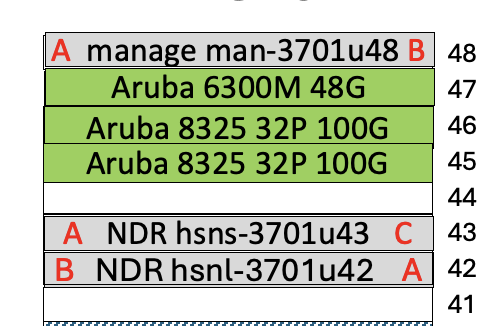
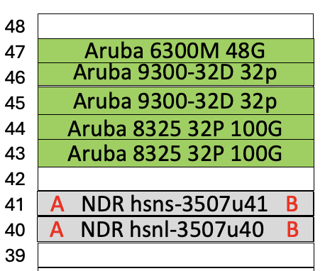
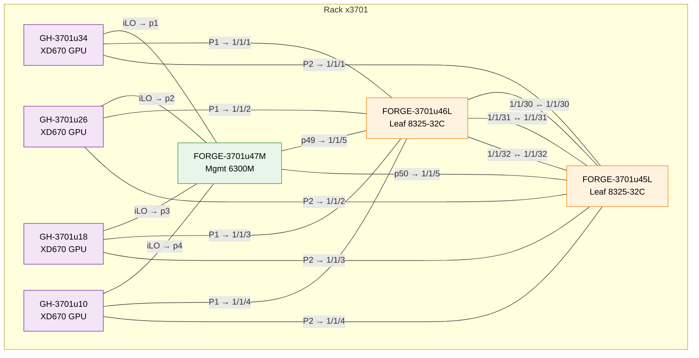
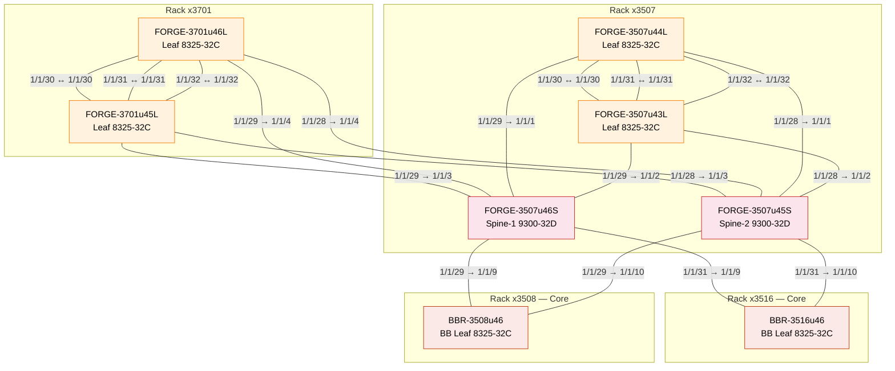

# System Management Recabling Plan

## Overview

System Managment will update racks x3701 and x3507. Only management and primary ethernet networks will be updated. No high speed updates are required.

## Rack x3701 Switch Updates

Add the Aruba 6300 and two 8325's to u47, u46, and u45. The XD670 ILO ports on the existing management switch (MAN-3701U48) will be removed. Everything else on that switch will remain connected. No changes to the high speed sitches (HSNL-3701U42 and HSNL-3701U43) are required. An existing Aruba 8325 is currently in the rack and can be repurposed for this work.

> **Note:** New (and repurposed) switches shown with a green background.

## Rack x3507 Switch Updates

Add the Aruba 6300, two 9300's, and two 8325's to u43 through u47. No changes to the high speed sitches (HSNL-3507U42 and HSNL-3507U43) are required. SERV-3507U05 iLO is connected to the local 6300M (FORGE-3507u47M) at port 17.

Two DL380's (DL-3507U23 and DL-3507U25) are NOT included in this recabling effort. No cables should be removed. Anything that that these nodes are cabled to should be left in place.

> **Note:** New switches shown with a green background.

## Server Connections — Rack x3701

## Server Connections — Rack x3507

```mermaid
graph TB
    classDef server fill:#e1f5fe,stroke:#0288d1,color:#000
    classDef mgmt fill:#e8f5e9,stroke:#388e3c,color:#000
    classDef leaf fill:#fff3e0,stroke:#f57c00,color:#000

    subgraph x3507["Rack x3507"]
        SERV21["SERV-3507u21<br/>DL380"]:::server
        SERV19["SERV-3507u19<br/>DL380"]:::server
        SERV17["SERV-3507u17<br/>DL380"]:::server
        SERV15["SERV-3507u15<br/>DL380"]:::server
        SERV13["SERV-3507u13<br/>DL380"]:::server
        SERV11["SERV-3507u11<br/>DL380"]:::server
        SERV9["SERV-3507u9<br/>DL380"]:::server
        SERV7["SERV-3507u7<br/>DL380"]:::server
        SERV5["SERV-3507u5<br/>DL380"]:::server
        FORGE3507u47M["FORGE-3507u47M<br/>Mgmt 6300M"]:::mgmt
        FORGE3507u44L["FORGE-3507u44L<br/>Leaf 8325-32C"]:::leaf
        FORGE3507u43L["FORGE-3507u43L<br/>Leaf 8325-32C"]:::leaf
    end

    MAN3507u48["MAN-3507u48<br/>Mgmt Switch"]:::mgmt

    %% ── LAYER 1: Management iLO (1GbE, CAT6) ──

    SERV21 -- "iLO → p9" --- FORGE3507u47M
    SERV19 -- "iLO → p10" --- FORGE3507u47M
    SERV17 -- "iLO → p11" --- FORGE3507u47M
    SERV15 -- "iLO → p12" --- FORGE3507u47M
    SERV13 -- "iLO → p13" --- FORGE3507u47M
    SERV11 -- "iLO → p14" --- FORGE3507u47M
    SERV9 -- "iLO → p15" --- FORGE3507u47M
    SERV7 -- "iLO → p16" --- FORGE3507u47M
    SERV5 -- "iLO → p17" --- FORGE3507u47M
    SERV5 -- "OCP-p1 → p10" --- MAN3507u48

    %% ── LAYER 1b: Mgmt switch SFP28 uplinks → leaf pairs (10G DAC) ──

    FORGE3507u47M -- "p49 → 1/1/10" --- FORGE3507u44L
    FORGE3507u47M -- "p50 → 1/1/10" --- FORGE3507u43L

    %% ── LAYER 1c: 100GbE Leaf — DL380 CX6 dual-homed (QSFP28 DAC 3m) ──

    SERV21 -- "P1 → 1/1/1" --- FORGE3507u44L
    SERV21 -- "P2 → 1/1/1" --- FORGE3507u43L
    SERV19 -- "P1 → 1/1/2" --- FORGE3507u44L
    SERV19 -- "P2 → 1/1/2" --- FORGE3507u43L
    SERV17 -- "P1 → 1/1/3" --- FORGE3507u44L
    SERV17 -- "P2 → 1/1/3" --- FORGE3507u43L
    SERV15 -- "P1 → 1/1/4" --- FORGE3507u44L
    SERV15 -- "P2 → 1/1/4" --- FORGE3507u43L
    SERV13 -- "P1 → 1/1/5" --- FORGE3507u44L
    SERV13 -- "P2 → 1/1/5" --- FORGE3507u43L
    SERV11 -- "P1 → 1/1/6" --- FORGE3507u44L
    SERV11 -- "P2 → 1/1/6" --- FORGE3507u43L
    SERV9 -- "P1 → 1/1/7" --- FORGE3507u44L
    SERV9 -- "P2 → 1/1/7" --- FORGE3507u43L
    SERV7 -- "P1 → 1/1/8" --- FORGE3507u44L
    SERV7 -- "P2 → 1/1/8" --- FORGE3507u43L
    SERV5 -- "P1 → 1/1/9" --- FORGE3507u44L
    SERV5 -- "P2 → 1/1/9" --- FORGE3507u43L

    %% ── x3507 ISL: u44L ↔ u43L (VSX) ──
    FORGE3507u44L -- "1/1/30 ↔ 1/1/30" --- FORGE3507u43L
    FORGE3507u44L -- "1/1/31 ↔ 1/1/31" --- FORGE3507u43L
    FORGE3507u44L -- "1/1/32 ↔ 1/1/32" --- FORGE3507u43L
```

## Legend

| Color | Layer | Speed | Cable Type |
|-------|-------|-------|------------|
| Blue (management) | Layer 1 | 1 GbE | CAT6 STP 3m (intra-rack) / CAT5 RJ45 4.3m (cross-rack) |
| Orange (backbone) | Layer 1c | 100 GbE | QSFP28-QSFP28 DAC 3m (intra-rack) |
| Orange (backbone) | Layer 2 | 100 GbE | QSFP28-QSFP28 AOC 15m (cross-rack) / DAC 3m (intra-rack) |

---

## Leaf / Spine / Backbone Fabric

## Switch Cabling Tables

### FORGE-3507u44L — Leaf-1 (Aruba 8325-32C, 32× 100G QSFP28)

| Port | Remote Device | Remote Port | Function | Cable |
|------|---------------|-------------|----------|-------|
| 1/1/1 | SERV-3507u21 | Port 1 | Server downlink | 100G DAC 3m |
| 1/1/2 | SERV-3507u19 | Port 1 | Server downlink | 100G DAC 3m |
| 1/1/3 | SERV-3507u17 | Port 1 | Server downlink | 100G DAC 3m |
| 1/1/4 | SERV-3507u15 | Port 1 | Server downlink | 100G DAC 3m |
| 1/1/5 | SERV-3507u13 | Port 1 | Server downlink | 100G DAC 3m |
| 1/1/6 | SERV-3507u11 | Port 1 | Server downlink | 100G DAC 3m |
| 1/1/7 | SERV-3507u9 | Port 1 | Server downlink | 100G DAC 3m |
| 1/1/8 | SERV-3507u7 | Port 1 | Server downlink | 100G DAC 3m |
| 1/1/9 | SERV-3507u5 | Port 1 | Server downlink | 100G DAC 3m |
| 1/1/10 | FORGE-3507u47M | 49 | Mgmt switch uplink | 10G DAC 3m |
| 1/1/28 | FORGE-3507u45S | 1/1/1 | Spine-2 uplink | 100G DAC 3m |
| 1/1/29 | FORGE-3507u46S | 1/1/1 | Spine-1 uplink | 100G DAC 3m |
| 1/1/30 | FORGE-3507u43L | 1/1/30 | ISL (VSX) | 100G DAC 3m |
| 1/1/31 | FORGE-3507u43L | 1/1/31 | ISL (VSX) | 100G DAC 3m |
| 1/1/32 | FORGE-3507u43L | 1/1/32 | ISL (VSX) | 100G DAC 3m |
| mgmt   | FORGE-3507u47M | 46          | Management | CAT6 3m |

### FORGE-3507u43L — Leaf-2 (Aruba 8325-32C, 32× 100G QSFP28)

| Port | Remote Device | Remote Port | Function | Cable |
|------|---------------|-------------|----------|-------|
| 1/1/1 | SERV-3507u21 | Port 2 | Server downlink | 100G DAC 3m |
| 1/1/2 | SERV-3507u19 | Port 2 | Server downlink | 100G DAC 3m |
| 1/1/3 | SERV-3507u17 | Port 2 | Server downlink | 100G DAC 3m |
| 1/1/4 | SERV-3507u15 | Port 2 | Server downlink | 100G DAC 3m |
| 1/1/5 | SERV-3507u13 | Port 2 | Server downlink | 100G DAC 3m |
| 1/1/6 | SERV-3507u11 | Port 2 | Server downlink | 100G DAC 3m |
| 1/1/7 | SERV-3507u9 | Port 2 | Server downlink | 100G DAC 3m |
| 1/1/8 | SERV-3507u7 | Port 2 | Server downlink | 100G DAC 3m |
| 1/1/9 | SERV-3507u5 | Port 2 | Server downlink | 100G DAC 3m |
| 1/1/10 | FORGE-3507u47M | 50 | Mgmt switch uplink | 10G DAC 3m |
| 1/1/28 | FORGE-3507u45S | 1/1/2 | Spine-2 uplink | 100G DAC 3m |
| 1/1/29 | FORGE-3507u46S | 1/1/2 | Spine-1 uplink | 100G DAC 3m |
| 1/1/30 | FORGE-3507u44L | 1/1/30 | ISL (VSX) | 100G DAC 3m |
| 1/1/31 | FORGE-3507u44L | 1/1/31 | ISL (VSX) | 100G DAC 3m |
| 1/1/32 | FORGE-3507u44L | 1/1/32 | ISL (VSX) | 100G DAC 3m |
| mgmt   | FORGE-3507u47M | 45          | Management | CAT6 3m |

### FORGE-3507u46S — Spine-1 (Aruba 9300-32D, 32× 400G QSFP-DD + 2× 10G SFP+)

| Port | Remote Device | Remote Port | Function | Cable |
|------|---------------|-------------|----------|-------|
| 1/1/1 | FORGE-3507u44L | 1/1/29 | Leaf-1 downlink | 100G DAC 3m |
| 1/1/2 | FORGE-3507u43L | 1/1/29 | Leaf-2 downlink | 100G DAC 3m |
| 1/1/3 | FORGE-3701u45L | 1/1/29 | x3701 Leaf downlink | 100G AOC 15m |
| 1/1/4 | FORGE-3701u46L | 1/1/29 | x3701 Leaf downlink | 100G AOC 15m |
| 1/1/29 | BBR-3508u46 | 1/1/9 | BB Leaf uplink | 100G AOC 15m |
| 1/1/31 | BBR-3516u46 | 1/1/9 | BB Leaf uplink | 100G AOC 15m |
| mgmt   | FORGE-3507u47M | 48          | Management | CAT6 3m |

### FORGE-3507u45S — Spine-2 (Aruba 9300-32D, 32× 400G QSFP-DD + 2× 10G SFP+)

| Port | Remote Device | Remote Port | Function | Cable |
|------|---------------|-------------|----------|-------|
| 1/1/1 | FORGE-3507u44L | 1/1/28 | Leaf-1 downlink | 100G DAC 3m |
| 1/1/2 | FORGE-3507u43L | 1/1/28 | Leaf-2 downlink | 100G DAC 3m |
| 1/1/3 | FORGE-3701u45L | 1/1/28 | x3701 Leaf downlink | 100G AOC 15m |
| 1/1/4 | FORGE-3701u46L | 1/1/28 | x3701 Leaf downlink | 100G AOC 15m |
| 1/1/29 | BBR-3508u46 | 1/1/10 | BB Leaf uplink | 100G AOC 15m |
| 1/1/31 | BBR-3516u46 | 1/1/10 | BB Leaf uplink | 100G AOC 15m |
| mgmt   | FORGE-3507u47M | 47          | Management | CAT6 3m |

### BBR-3508u46 — Router-1 (Aruba 8325-32C 32-PORT 100G QSFP+/QSFP28)

| Port | Remote Device | Remote Port | Function | Cable |
|------|---------------|-------------|----------|-------|
| 1/1/9 | FORGE-3507u46S | 1/1/29 | BB Leaf uplink | 100G AOC 15m |
| 1/1/10 | FORGE-3507u45S | 1/1/29 | BB Leaf uplink | 100G AOC 15m |
| 1/1/20 | FORT-3508u41 | 1/1/25 | Fortigate uplink | 100G AOC 15m |

### BBR-3516u46 — Router-2 (Aruba 8325-32C 32-PORT 100G QSFP+/QSFP28)

| Port | Remote Device | Remote Port | Function | Cable |
|------|---------------|-------------|----------|-------|
| 1/1/9 | FORGE-3507u46S | 1/1/31 | BB Leaf uplink | 100G AOC 15m |
| 1/1/10 | FORGE-3507u45S | 1/1/31 | BB Leaf uplink | 100G AOC 15m |
| 1/1/20 | FORT-3516u41 | 1/1/25 | Fortigate uplink | 100G AOC 15m |

### FORGE-3701u46L — Leaf (Aruba 8325-32C, 32× 100G QSFP28)

| Port | Remote Device | Remote Port | Function | Cable |
|------|---------------|-------------|----------|-------|
| 1/1/1 | GH-3701u34 | Port 1 | GPU downlink | 100G DAC 3m |
| 1/1/2 | GH-3701u26 | Port 1 | GPU downlink | 100G DAC 3m |
| 1/1/3 | GH-3701u18 | Port 1 | GPU downlink | 100G DAC 3m |
| 1/1/4 | GH-3701u10 | Port 1 | GPU downlink | 100G DAC 3m |
| 1/1/5 | FORGE-3701u47M | 49 | Mgmt switch uplink | 10G DAC 3m |
| 1/1/28 | FORGE-3507u45S | 1/1/4 | Spine-2 uplink | 100G AOC 15m |
| 1/1/29 | FORGE-3507u46S | 1/1/4 | Spine-1 uplink | 100G AOC 15m |
| 1/1/30 | FORGE-3701u45L | 1/1/30 | ISL (VSX) | 100G DAC 3m |
| 1/1/31 | FORGE-3701u45L | 1/1/31 | ISL (VSX) | 100G DAC 3m |
| 1/1/32 | FORGE-3701u45L | 1/1/32 | ISL (VSX) | 100G DAC 3m |

### FORGE-3701u45L — Leaf (Aruba 8325-32C, 32× 100G QSFP28)

| Port | Remote Device | Remote Port | Function | Cable |
|------|---------------|-------------|----------|-------|
| 1/1/1 | GH-3701u34 | Port 2 | GPU downlink | 100G DAC 3m |
| 1/1/2 | GH-3701u26 | Port 2 | GPU downlink | 100G DAC 3m |
| 1/1/3 | GH-3701u18 | Port 2 | GPU downlink | 100G DAC 3m |
| 1/1/4 | GH-3701u10 | Port 2 | GPU downlink | 100G DAC 3m |
| 1/1/5 | FORGE-3701u47M | 50 | Mgmt switch uplink | 10G DAC 3m |
| 1/1/28 | FORGE-3507u45S | 1/1/3 | Spine-2 uplink | 100G AOC 15m |
| 1/1/29 | FORGE-3507u46S | 1/1/3 | Spine-1 uplink | 100G AOC 15m |
| 1/1/30 | FORGE-3701u46L | 1/1/30 | ISL (VSX) | 100G DAC 3m |
| 1/1/31 | FORGE-3701u46L | 1/1/31 | ISL (VSX) | 100G DAC 3m |
| 1/1/32 | FORGE-3701u46L | 1/1/32 | ISL (VSX) | 100G DAC 3m |

### BBR-3516u46 — BB Leaf (Aruba 8325-32C, 32× 100G QSFP28)

| Port | Remote Device | Remote Port | Function | Cable |
|------|---------------|-------------|----------|-------|
| 1/1/9 | FORGE-3507u46S | 1/1/31 | Spine-1 downlink | 100G AOC 15m |
| 1/1/10 | FORGE-3507u45S | 1/1/31 | Spine-2 downlink | 100G AOC 15m |

### BBR-3508u46 — BB Leaf (Aruba 8325-32C, 32× 100G QSFP28)

| Port | Remote Device | Remote Port | Function | Cable |
|------|---------------|-------------|----------|-------|
| 1/1/9 | FORGE-3507u46S | 1/1/29 | Spine-1 downlink | 100G AOC 15m |
| 1/1/10 | FORGE-3507u45S | 1/1/29 | Spine-2 downlink | 100G AOC 15m |

### FORGE-3701u47M — Mgmt (Aruba 6300M, 48× 1G + 4× 25G SFP28)

| Port | Remote Device | Remote Port | Function | Cable |
|------|---------------|-------------|----------|-------|
| 1 | GH-3701u34 | iLO | Management | CAT6 3m |
| 2 | GH-3701u26 | iLO | Management | CAT6 3m |
| 3 | GH-3701u18 | iLO | Management | CAT6 3m |
| 4 | GH-3701u10 | iLO | Management | CAT6 3m |
| 49 | FORGE-3701u46L | 1/1/5 | Leaf uplink | 10G DAC 3m |
| 50 | FORGE-3701u45L | 1/1/5 | Leaf uplink | 10G DAC 3m |

### FORGE-3507u47M — Mgmt (Aruba 6300M, 48× 1G + 4× 25G SFP28)

| Port | Remote Device | Remote Port | Function | Cable |
|------|---------------|-------------|----------|-------|
| 9 | SERV-3507u21 | iLO | Management | CAT6 3m |
| 10 | SERV-3507u19 | iLO | Management | CAT6 3m |
| 11 | SERV-3507u17 | iLO | Management | CAT6 3m |
| 12 | SERV-3507u15 | iLO | Management | CAT6 3m |
| 13 | SERV-3507u13 | iLO | Management | CAT6 3m |
| 14 | SERV-3507u11 | iLO | Management | CAT6 3m |
| 15 | SERV-3507u9 | iLO | Management | CAT6 3m |
| 16 | SERV-3507u7 | iLO | Management | CAT6 3m |
| 17 | SERV-3507u5 | iLO | Management | CAT6 3m |
| 45 | FORGE-3507u43 | mgmt        | Management | CAT6 3m |
| 46 | FORGE-3507u44L| mgmt        | Management | CAT6 3m |
| 47 | FORGE-3507u45S | mgmt        | Management | CAT6 3m |
| 48 | FORGE-3507u46S | mgmt        | Management | CAT6 3m |
| 49 | FORGE-3507u44L | 1/1/10 | Leaf uplink | 10G DAC 3m |
| 50 | FORGE-3507u43L | 1/1/10 | Leaf uplink | 10G DAC 3m |
| mgmt   | SERV-3507u5 | ocp1-p2     | Management | CAT6 3m |
---
